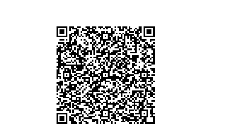

## About QR Scanner9

This is a pure javascript project. Tailwind css, Pure Javascripts and QR code package is used here 

## Sponsors

We would like to extend our thanks to the following sponsors for funding development. 
If you are interested in becoming a sponsor, please visit the  [https://dip-qr-code-scanner.netlify.app/).

## Contributing

Thank you for considering contributing to QR CODE Scanner! 

## Code of Conduct

## Security Vulnerabilities

If you discover a security vulnerability, please send an e-mail to Dip Ghosh via( mailto:dipghosh638@gmail.com). All security vulnerabilities will be promptly addressed.

## License

This is open-sourced software licensed under the [MIT license](https://opensource.org/licenses/MIT).
